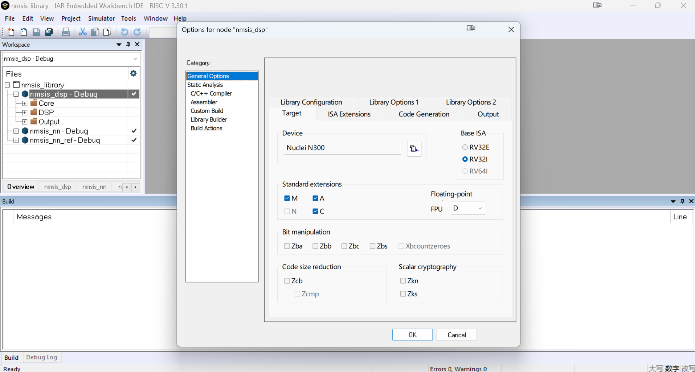
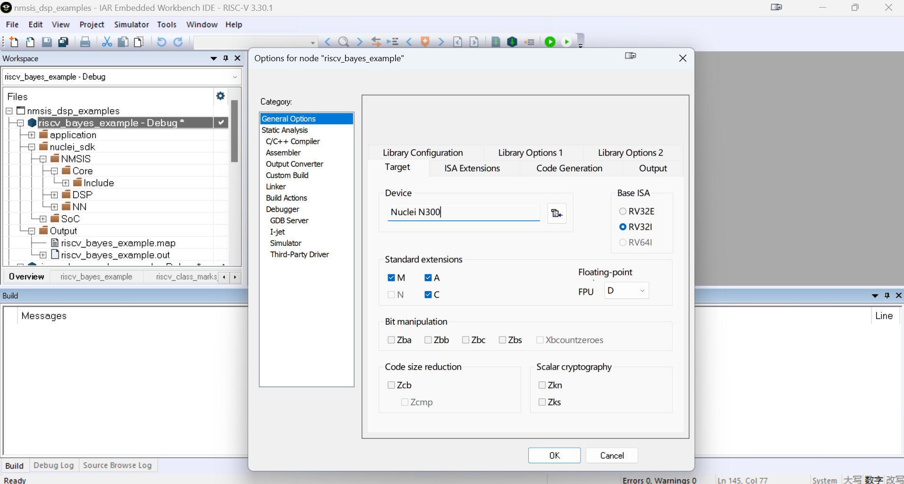

# IAR Embedded Workbench IDE Projects For Nuclei Processors

> [!NOTE]
> This NMSIS IAR prebuilt projects maybe out of date, you may need to add NMSIS DSP and NN source code into IAR projects
> by yourself.

## Introduction

In this folder, we provided a prebuilt IAR workspace(for IAR RISC-V version 3.30.1) to build NMSIS DSP/NN libraries.

> You can refer to these demo projects to build your own iar projects.

> If you want to evaluate Nuclei N300 DSP feature(P-ext 0.5.4), you can change the file `C:\Program Files\IAR Systems\Embedded Workbench 9.2\riscv\config\devices\Nuclei\N300.menu`, change `RV32IMAFDCB_Zkn_Zks_Zcb_Zcmp` to `RV32IMAFDCB_Zkn_Zks_Zcb_Zcmp_Xandesdsp`, `Xandesdsp` is based on P-ext 0.5.0, there are some intruction encoding updates from 0.5.0 to 0.5.4, and we use IAR custom instruction intrinsic to implement the different instructions, please check `NMSIS/Core/core_feature_dsp.h` for details, and in future, we will co-operate with IAR to support full Nuclei DSP feature including(N1/N2/N3 custom enhancement instructions).

These projects demonstrated the following features:

- Provide support for Nuclei Evaluation SoC which is a prototype and evaluation SoC mainly
  used to evaluate Nuclei RISC-V processor such as 200/300/600/900/1000 series.

- By default, the SoC series is N300, RISC-V Extension IMAFDC are selected in this project, and the optimization level is "High Speed".

- If you want to **enable P extension**, choose ``Xandesdsp``(based on P-ext 0.5.0) option in IAR project settings: the `Options->General Options->ISA Extensions->DSP`.
  > And don't choose "P", which generates no ``__riscv_dsp`` macro

- Currently both Nuclei RV32 and RV64 processors are supported in this iar ideprojects.

- **nmsis_library.eww** is used to build NMSIS DSP and NN library, the NMSIS Core/DSP/NN header used is the one in NMSIS project, you can build different library according to the RISC-V ISA and extension selected, and also test the built library using the dsp and nn iar examples workspace list below.

- **nmsis_dsp_examples.eww** and **nmsis_nn_examples.eww** provide example code demonstrating DSP and NN functions.

> **nmsis_dsp_examples.eww** and **nmsis_nn_examples.eww** prebuilt iar workspace required to use Nuclei SDK 0.8.0 release,
> and these prebuilt project used NMSIS Core/DSP/NN header files provided in Nuclei SDK which is the NMSIS 1.4.0
> release version, and default using library is also Nuclei SDK prebuilt NMSIS 1.4.0 DSP/NN GCC library.

## How to use

How to build the projects in **nmsis_dsp_examples.eww** and **nmsis_nn_examples.eww** workspace:

* Clone the ``NMSIS`` and ``nuclei-sdk`` respository

```shell
git clone https://github.com/Nuclei-Software/nuclei-sdk.git
git clone https://github.com/Nuclei-Software/NMSIS.git
cd nuclei-sdk
# make sure you are using Nuclei >= 0.5.0 release
git checkout master
# make sure you are using NMSIS >= 1.2.0 release
cd NMSIS
git checkout master
```

After done, the ``nuclei-sdk`` and ``NMSIS`` directory must place **in the same level** like:

```shell
├── NMSIS
│   ├── Device
│   ├── LICENSE
│   ├── NMSIS
│   └── README.md
└── nuclei-sdk
    ├── application
    ├── Build
    ├── Components
    ├── doc
    ├── LICENSE
    ├── Makefile
    ├── NMSIS
    ├── NMSIS_VERSION
    ├── npk.yml
    ├── OS
    ├── package.json
    ├── README.md
    ├── SConscript
    ├── setup.bat
    ├── setup.ps1
    ├── setup.sh
    ├── SoC
    ├── test
    └── tools
```

* The you can directly build the examples successfully.
* The examples use the NN library or DSP library (P extension disabled) prebuilt in the `Your path\NMSIS\NMSIS\ideprojects\iar\library\prebuilt``, you can replaced it by rebuilding the library youself in the **nmsis_library** workspace (**DSP for example**):

  * When **nmsis_library** projects built done, the generated library with **.a** suffix is placed in `Your path\NMSIS\NMSIS\ideprojects\iar\library\Debug\Exe` called **nmsis_dsp.a**, and **nmsis_nn.a**, which is respectively ready for the **nmsis_dsp_examples** and **nmsis_nn_examples** projects.

  * Select an example you want to test, and then change the project settings to choose correct built DSP/NN IAR library as steps described below.

  * Option 1: Copy and rename **nmsis_dsp.a**, replace the `Your path\NMSIS\NMSIS\ideprojects\iar\library\prebuilt\libnmsis_dsp_rv32imafdc.a`

  * Option 2: Or select the library path in IAR project settings: the `Options->General Options->Linker->Library` to where **nmsis_dsp.a** is.

  * Clean and rebuild selected dsp or nn example.

  * The cpu series and full ISA extension must be the same of `library and example` projects, and so is the optimization level in case of strange things.

* After example built successfully, the executable target is in `Your path\NMSIS\NMSIS\ideprojects\iar\examples\Debug\Exe` with **.out** which can be downloaded to our FPGA evaluation board.

You can directly try with these prebuilt IAR workspaces by clicking ``nmsis_library.eww``/``nmsis_dsp_examples.eww``/``nmsis_nn_examples.eww`` after you have installed [IAR Workbench](https://www.iar.com/riscv).





For more details about how to use IAR workbench, please refer to its user guides.

## FAQs

* **nn_cifar10_example** and **riscv_linear_interp_example** use the linker script `Your path\NMSIS\NMSIS\ideprojects\iar\linker\iar_evalsoc_ilm_512K.icf`, while by default others use the one in `Your path\nuclei-sdk\SoC\evalsoc\Board\nuclei_fpga_eval\Source\IAR`:
  * nn_cifar10_example takes more than 64KBytes rom/ram size, so it uses `iar_evalsoc_ilm_512K.icf` where set ROM and RAM to 512KBytes(our Evaluation SoC's best config bitstream ilm/dlm size)

  * ``riscv_linear_interp_example`` takes more than 512KB ram size, so you will see this building error

    > unable to allocate space for sections/blocks with a total estimated minimum size of 0xb'591d bytes (max align 0x100) in <[0x8000'0000-0x8000'ffff]> (total uncommitted space 0xffb2).

    > unable to allocate space for sections/blocks with a total estimated minimum size of 0xb'9244 bytes (max align 0x10) in <[0x9000'0000-0x9000'ffff]> (total uncommitted space 0x1'0000).

    If your Nuclei Evaluation SoC at hand has ILM/DLM bigger than above **total estimated minimum size**, and to run it, you can modify the memory range located here in `iar_evalsoc_ilm_512K.icf`:

    > define region ROM_region32 = mem:[from 0x80000000 to 0x8007FFFF];

    > define region RAM_region32 = mem:[from 0x90000000 to 0x9007FFFF];

* Stack and heap size in IAR is **0x1000(4KBytes)**, you can adapt it according to your application in IAR project settings: `Options->General Options->Code Generation->Stack/Heap`.

* The examples build with **header files** from `Your path\nuclei-sdk\NMSIS`, please check whether the version is same with `Your path\NMSIS\NMSIS`, if not, sync it according to `Your path\NMSIS\NMSIS`.

* [IAR IDE shows that Fatal Error\[Li001\]: could not open file ideprojects\iar\library\prebuilt\libnmsis_dsp_rv32imafdc.a](https://github.com/Nuclei-Software/NMSIS/issues/4)
